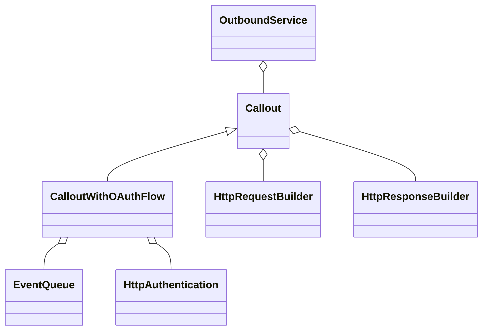

# OutboundService - Documentação Técnica

## Visão Geral

A classe `OutboundService` e suas derivadas compõem o núcleo do framework de integração outbound, permitindo o envio de dados para sistemas externos via HTTP, com suporte a autenticação, transformação de payloads e tratamento de respostas.

---

## Diagrama Simplificado



---

## Principais Classes

### 1. OutboundService

```apex
public virtual class OutboundService {
    protected Callout callout;
    protected EventQueue event;

    public OutboundService(String eventName);
    public OutboundService(EventQueue event);
    public OutboundService(EventQueue event, Callout callout);

    virtual public Object send(Object data);
    public Callout getCallout();
    public void setCallout(Callout callout);
    public EventQueue getEvent();
}
```

- **Responsabilidade:** Orquestra o envio de dados para um endpoint externo.
- **Dependências:**  
  - `Callout`: Responsável por construir e executar a requisição HTTP.
  - `EventQueue`: Representa o contexto do evento disparador.

#### Uso Básico

```apex
OutboundService service = new OutboundService('MyEvent');
Object response = service.send(myPayload);
```

#### Extensão

Para customizar o comportamento, crie subclasses e sobrescreva métodos como `send`.

---

### 2. Callout

```apex
public virtual class Callout {
    protected EventQueue event;
    protected OutboundEventConfig config;
    protected HttpRequestBuilder requestBuilder;
    protected HttpResponseBuilder responseBuilder;

    public Callout(EventQueue event);
    public Callout(EventQueue event, HttpRequestBuilder requestBuilder);

    virtual public Object send(Object requestContent);
    virtual protected void requestPrepare(Object requestContent);
}
```

- **Responsabilidade:** Monta e executa a chamada HTTP.
- **Dependências:**  
  - `HttpRequestBuilder`: Monta a requisição.
  - `HttpResponseBuilder`: Processa a resposta.

#### Extensão

Sobrescreva `send` ou `requestPrepare` para customizar headers, payloads ou tratamento de resposta.

---

### . CalloutWithOAuthFlow

```apex
public class CalloutWithOAuthFlow extends Callout {
    override public Object send(Object requestContent);
    virtual public void authenticate();
}
```

- **Responsabilidade:** Realiza autenticação OAuth antes do envio da requisição.
- **Dependências:**  
  - Usa um fluxo de obtenção de token via `OAuthClientCredentialRequest`.

---

## Como Expandir

- **Customizar Autenticação:**  
  Implemente novas subclasses de `Callout` ou `AbstractAuthenticator` para suportar outros tipos de autenticação (API Key, JWT, etc).

- **Transformação de Payload:**  
  Crie subclasses de `OutboundService` ou utilize comandos que transformam o payload antes do envio.

- **Tratamento de Resposta:**  
  Implemente novos `HttpResponseHandler` para processar diferentes formatos de resposta.

---

## Exemplo de Expansão: Suporte a API Key

```apex
public class ApiKeyCallout extends Callout {
    override protected void requestPrepare(Object requestContent) {
        super.requestPrepare(requestContent);
        this.requestBuilder.withHeader('x-api-key', 'MY_API_KEY');
    }
}
```

Uso:

```apex
OutboundService service = new OutboundService(event, new ApiKeyCallout(event));
service.send(payload);
```

---

## Testes

Utilize as classes mock (`CalloutTest.CalloutMock`, etc) para testar integrações sem realizar chamadas externas reais.

---

## Resumo das Dependências

- **EventQueue:** Contexto do evento/processo.
- **OutboundEventConfig:** Configuração do endpoint, método HTTP, headers, etc.
- **HttpRequestBuilder/HttpResponseBuilder:** Montagem e parsing das requisições/respostas.
- **Autenticação:** Pode ser expandida via subclasses.

---

## Conclusão

O framework é altamente extensível e desacoplado. Para novos tipos de integração, basta criar subclasses das classes principais e sobrescrever os métodos necessários.
